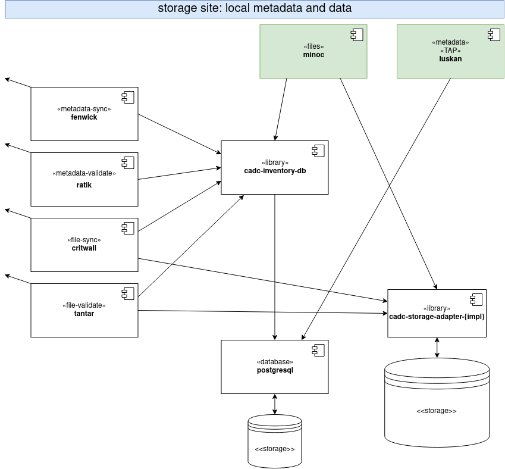
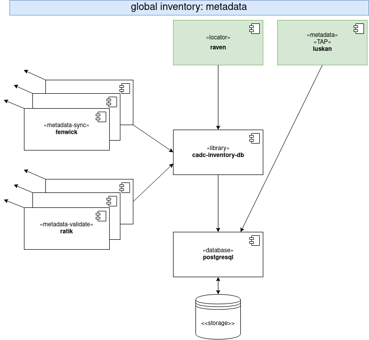

# OpenCADC Storage Inventory System

The Storage Inventory system is designed to manage archival file storage for a science
data archive. The system is designed to have one or more sites:

- a **storage site** includes back-end storage (for files), a database with the local inventory,
a **files** service, and a **metadata** service

- a **global inventory** includes a database with an inventory of all files at all known storage 
sites, a **locator** service, a **metadata** service, a **metadata-sync** process for each storage 
site, and a periodic **metadata-validate** process for each storage site

A storage site can be useful as a stand-alone deployment that provides REST API access to back 
end storage, but the deployment of a global inventory allows multiple storage sites to store a
collection of files distributed across the sites for additional redundancy, proximity to users
and/or computational resources, etc. 

With the deployment of a global inventory, one would normally add **metadata-sync** and **file-sync** 
process(es) to storage sites to sync content that originates at other sites. There are mechanisms
to apply selectivity in order to sync a subset of the global inventory to any one storage site.

 
In addition to **storage site**s and **global inventory**, there are several external services that 
are required for a complete functional system:

- a **registry** service to lookup the current URL of other services; uses service identifiers
(IVOA resourceID as one would find in an IVOA registry)
- one or more **users** and **groups** service(s) to support authentication (users) and authorization (groups);
permission grants are expressed as grants to a group (of users) and membership in a group is verified
using the <a href="https://www.ivoa.net/documents/GMS/">IVOA GMS</a> API implemented by **groups** service(s)
- one or more **permissions** services which return grant information for resources (files); the permissions
API is a prototype (non-standard)

## More details
[Storage Inventory Data Model](storage-inventory-dm/) [FAQ](docs/FAQ.md)

## storage-inventory-dm
This is the storage inventory data model and architecture documentation. TODO: Add an FAQ.

## baldur
This is an implementation of the **permissions** service API using configurable rules to grant access 
based on resource identifiers (Artifact.uri values in the inventory data model).

## critwall
This is an implementation of the **file-sync** process that runs at a storage site and downloads files.

## fenwick
This is an implementation of the **metadata-sync** process that runs at both global inventory and at
storage sites.

## luskan
This is an implementation of the **metadata** service that enables querying the storage inventory at
both global inventory and storage sites. It is an <a href="https://www.ivoa.net/documents/TAP/">IVOA TAP</a> 
service that supports ad-hoc querying of the inventory data model.

## minoc
This is an implementation of the **file** service that supports HEAD, GET, PUT, POST, DELETE operations
and IVOA SODA operations.

## raven
This is an implementation of the global **locator** service that supports transfer negotiation and direct
file GET requests.

## ratik
This is an implementation of the **metadata-validate** process that runs at both global inventory and at
storage sites.

## ringhold
This is an implementation of part of the **metadata-validate** process that cleans up after a change in 
local artifact selection policy. This is used if the new fenwick policy excludes artifacts previously synced.

## tantar
This is an implementation of the **file-validate** process that compares the inventory database against 
the back end storage at a storage site.

## cadc-*
These are libraries used in multiple services and applications.
